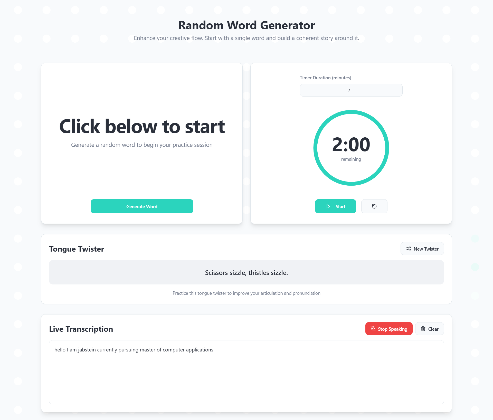

# Word Speak Dash

A modern web app to practice impromptu speaking, articulation, and communication skills using random words, tongue twisters, and live speech transcription.

## Screenshots

| Home (Random Word, Timer, Tongue Twister) | Live Transcription |
|------------------------------------------|-------------------|
|  |  |

## Features

- **Random Word Generator:** Instantly get a random word and its meaning to spark your speech or story.
- **Timer:** Built-in timer to challenge yourself to speak for a set duration (e.g., 2 minutes).
- **Tongue Twister Practice:** Shuffle and practice a wide variety of tongue twisters to improve articulation.
- **Live Transcription:** Uses the Web Speech API to transcribe your speech in real time.
- **Beautiful UI:** Responsive, modern design with animated dot grid background.
- **Accessible:** Keyboard and screen reader friendly, with clear feedback and controls.

## Tech Stack

- [React](https://react.dev/) + [TypeScript](https://www.typescriptlang.org/)
- [Vite](https://vitejs.dev/) for fast development
- [shadcn/ui](https://ui.shadcn.com/) for accessible, beautiful components
- [Tailwind CSS](https://tailwindcss.com/) for styling
- [Radix UI](https://www.radix-ui.com/) for primitives
- [Lucide Icons](https://lucide.dev/) for icons
- [React Query](https://tanstack.com/query/latest) for data fetching/caching
- [Sonner](https://sonner.emilkowal.ski/) for toasts/notifications

## Getting Started

1. **Clone the repository:**
   ```bash
   git clone <YOUR_GIT_URL>
   cd word-speak-dash
   ```

2. **Install dependencies:**
   ```bash
   npm install
   ```

3. **Start the development server:**
   ```bash
   npm run dev
   ```

4. **Open your browser:**  
   Visit [http://localhost:5173](http://localhost:5173) (or the port shown in your terminal).

## Usage

- Click "Generate Word" to get a new word and its meaning.
- Use the timer to challenge yourself to speak about the word.
- Try a random tongue twister to warm up your articulation.
- Use the live transcription to see your speech recognized in real time.

## Deployment

You can deploy this app using any static hosting service (Vercel, Netlify, GitHub Pages, etc.) or via [Lovable](https://lovable.dev/).

## Customization

- Add or edit the word list in `WordDisplay.tsx`.
- Add more tongue twisters in `TongueTwister.tsx`.
- Adjust timer, UI, or add new features as you wish!

## License

MIT
